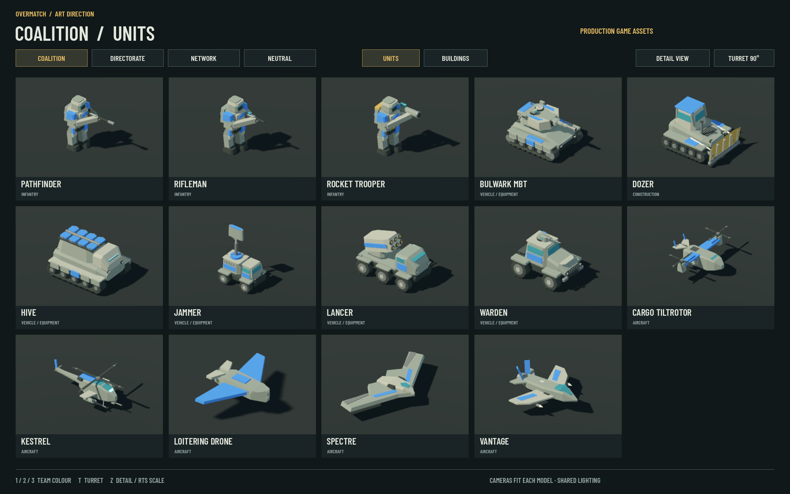
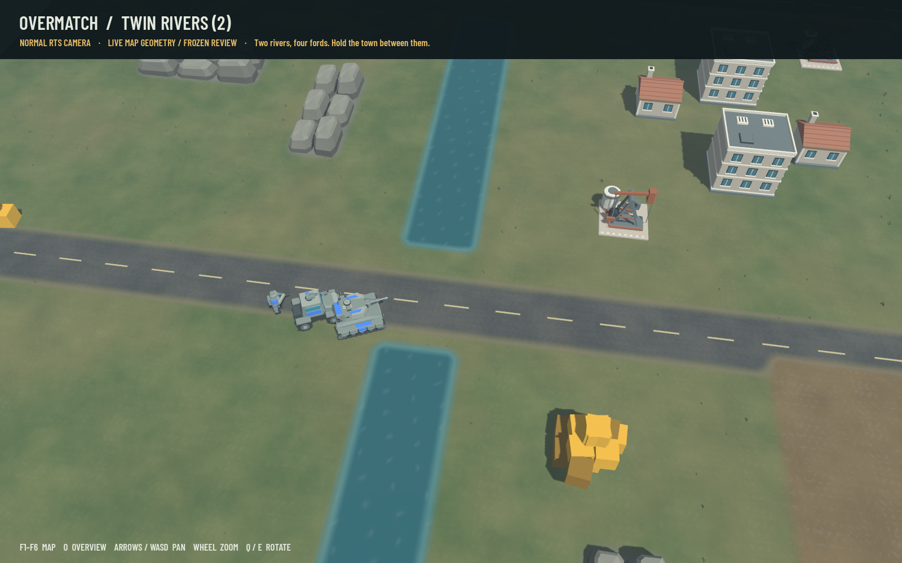

# Overmatch — roster and battlefield art

The approved Bulwark direction now covers the full roster: 41 further units,
30 faction buildings, four neutral props and all six map surfaces. The original
Bulwark asset remains unchanged from the approved version.

## Native roster galleries

| Faction | Units | Buildings |
| --- | --- | --- |
| Coalition | [14 units, including approved Bulwark](coalition-units.png) | [10 structures](coalition-buildings.png) |
| Directorate | [13 units](directorate-units.png) | [10 structures](directorate-buildings.png) |
| Network | [15 units](network-units.png) | [10 structures](network-buildings.png) |
| Neutral | — | [Civilian buildings, oil pump and trench](neutral-props.png) |



The gallery uses actual production GLBs, Godot's renderer and the real player
palette. Close-up cameras fit individual models for inspection; the interactive
scene also supports matched RTS scale, other team colours and rotated turrets.
The [RTS-scale turret check](coalition-rts-turrets.png) shows the Coalition roster
at its normal camera scale with turrets turned through 90°.

## Six maps

Map layouts, resource positions, spawns and passability are unchanged. Surface
detail, road markings, water, rock formations and low ground cover are visual.

| Battlefield | Previous terrain | Updated terrain |
| --- | --- | --- |
| Plain | [Before](maps/before/plain.png) | [After](maps/plain.png) |
| Twin Rivers | [Before](maps/before/twin_rivers.png) | [After](maps/twin_rivers.png) |
| Crossroads | [Before](maps/before/crossroads.png) | [After](maps/crossroads.png) |
| Highlands | [Before](maps/before/highlands.png) | [After](maps/highlands.png) |
| Oil Rush | [Before](maps/before/oil_rush.png) | [After](maps/oil_rush.png) |
| Open Steppe | [Before](maps/before/open_steppe.png) | [After](maps/open_steppe.png) |



Terrain pairs use the same frozen camera/scene and production lighting. Both
sides already contain the updated neutral props and three stationary scale units;
these comparisons isolate the terrain renderer. They are not active matches.
The normal game uses the same terrain material and geometry.

## Validation and limits

- All 76 GLBs checked against the committed baseline: **zero articulation,
  team-material or geometry-budget errors; zero bounds-expansion notes**.
- Every required `Turret`/`Rotor*` node, parent and local/world transform retained.
- All three factions and neutral props rendered and inspected in native Godot.
- All six terrain views, the [Highlands overview](maps/highlands-overview.png)
  and [normal fog masking](maps/fog-check.png) rendered without engine errors.
- A [live Twin Rivers skirmish](live-skirmish.png) ran through six simulated
  minutes with medium Directorate AI. The capture shows the final defeat screen
  after the AI defeated the idle player; this checks the complete game path.
  Earlier captures show [construction and portraits](live-skirmish_ui.png),
  [production queues](live-skirmish_queue.png) and the [pause menu](live-skirmish_pause.png).
- Engineering Vehicle's accidental Godot physics suffix corrected at asset level.
- All five standard generator entry points rebuild the complete roster successfully.
- C# game build: **zero warnings/errors**. Simulation tests: **106 passed**, none failed or skipped.
- [Full model audit](model-audit.json) and [baseline measurements](baseline-models.json).

The roster contains 164,738 triangles across all 76 different assets (baseline:
47,276). The most complex single model is the five-person Angry Mob at 7,384
triangles. Assets use at most eight materials and 16 material surfaces.

The isolated performance scene places **120 mixed units and 12 buildings** in one
viewport, with moving turrets/rotors, shadows, 4× MSAA and VSync disabled. A native
1600×1000 run on this Apple M4 measured:

| Wall timing | Baseline | Updated |
| --- | ---: | ---: |
| FPS | 96.08 | 98.07 |
| Mean frame | 10.408 ms | 10.197 ms |
| P95 frame | 16.878 ms | 13.544 ms |

The small difference is run-to-run noise, not a claimed speedup. This is a bounded
art-only smoke check, not a full-match benchmark: it excludes AI, combat, UI and
the terrain shader. Draw calls increased from 1,146 to 1,759 and rendered
primitives from approximately 197k to 614k in this view. Other hardware and larger
battles may behave differently. Wall timings are primary because Godot monitor
snapshots updated only three times during each sample.

[Baseline result](performance/baseline.json) · [Updated result](performance/current.json)

## Reproduce

```bash
bash tools/art/review_art.sh gallery
bash tools/art/review_art.sh terrain --terrain-map=twin_rivers
BLENDER_BIN=/path/to/blender bash tools/art/build_roster.sh
python3 tools/art/audit_models.py
```

[Review controls, full regeneration and benchmark instructions](../../game/art_review/README.md).
Code follows the repository GPLv3 licence; original assets follow CC BY 4.0.
